# Цель работы

Изучение методов кодирования и модуляции сигналов с помощью высокоуровневого языка программирования Octave. Определение спектра и параметров сигнала. Демонстрация принципов модуляции сигнала на примере аналоговой амплитудной модуляции. Исследование свойства самосинхронизации сигнала.

# Задание

1. Построить график функции y1 = sin x + (1/3) sin 3x + (1/5) sin 5x на интервале [-10; 10] и добавить график функции y2 = cos x + (1/3) cos 3x + (1/5) cos 5x.

2. Разработать код для получения графиков меандра с различным количеством гармоник.

3. Определить спектр двух отдельных сигналов (частоты 10 Гц и 40 Гц) и их суммы.

4. Продемонстрировать принципы амплитудной модуляции.

5. Реализовать кодирование сигналов для заданной битовой последовательности методами: униполярный, AMI, NRZ, RZ, манчестерский, дифференциальный манчестерский. Проверить свойство самосинхронизации и построить спектры.

# Теоретическое введение

## Сигнал и спектр

Сигнал — физическая величина, содержащая определённую информацию. Согласно теореме Котельникова (теореме Найквиста-Шеннона), непрерывная функция с ограниченным спектром полностью определяется своими значениями, отсчитанными через интервалы времени Δt = 1/(2F), где F — ширина спектра функции.

Любой периодический сигнал можно разложить в ряд Фурье:
f(t) = a0/2 + сумма от k=1 до бесконечности (ak cos(ω0 kt) + bk sin(ω0 kt))

## Методы кодирования

- **NRZ (Non Return to Zero)** — двухуровневый код: логической единице соответствует верхний уровень, логическому нулю — нижний.
- **AMI-код** — биты 0 представляются нулевым напряжением (0 В); биты 1 представляются поочерёдно значениями -U или +U.
- **RZ (Return to Zero)** — трёхуровневый код с возвратом к нулю после передачи каждого бита.
- **Манчестерский код** — двухуровневый код: логической единице соответствует переход вниз в центре бита, логическому нулю — переход вверх.
- **Дифференциальный манчестерский код** — двухуровневый код: при передаче нуля в начале битового интервала происходит перепад уровней, при передаче единицы перепад отсутствует.

# Выполнение лабораторной работы

## 1. Установка и настройка Octave

Перед началом работы была выполнена установка пакета Octave в системе Ubuntu с помощью команды `sudo apt install octave`. На рис. 1 показан процесс установки.

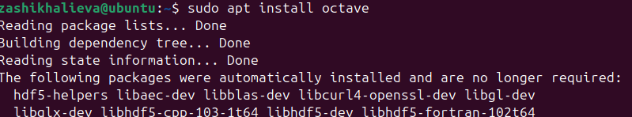{#fig:001 width=70%}

Версия установленного Octave была проверена командой `octave --version`. Установлена версия 8.4.0 (рис. 2).

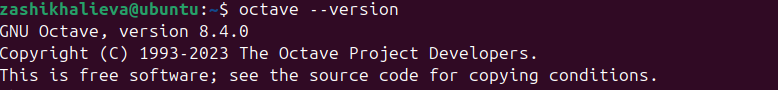{#fig:002 width=70%}

Для работы с сигналами был установлен пакет `signal`. На рис. 19 показан список установленных пакетов.

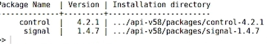{#fig:003 width=70%}

## 2. Построение графиков функций

В соответствии с заданием был создан файл `plot_sin_cos.m` для построения графиков функций y1 и y2. На рис. 4 представлен график функции y1 = sin x + (1/3) sin 3x + (1/5) sin 5x.

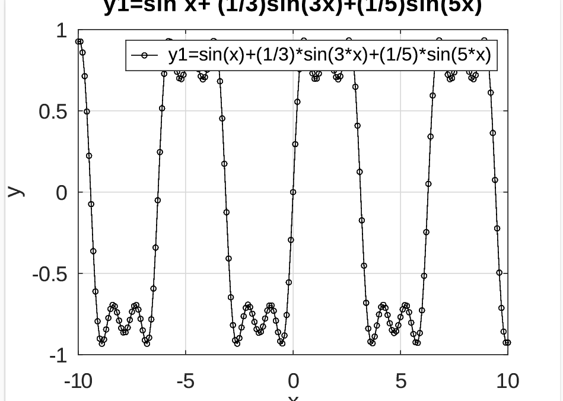{#fig:004 width=70%}

На рис. 5 представлен график функции y2 = cos x + (1/3) cos 3x + (1/5) cos 5x.

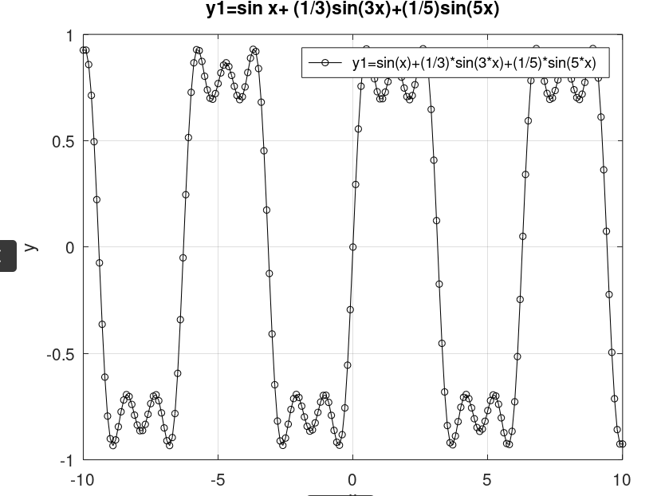{#fig:005 width=70%}

На рис. 6 показаны совмещённые графики обеих функций.

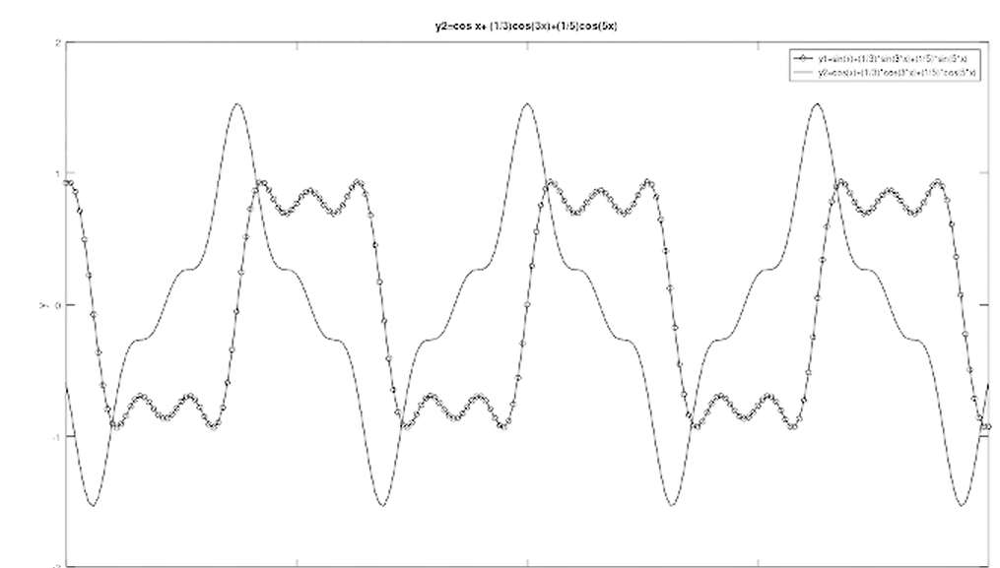{#fig:006 width=70%}

На рис. 7 представлены табличные данные, использованные для построения графиков.

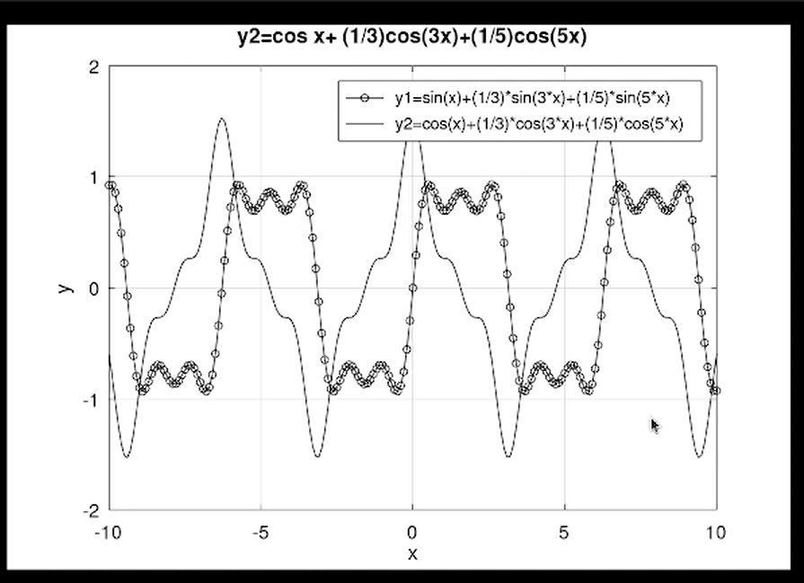{#fig:007 width=70%}

## 3. Разложение меандра в ряд Фурье

Для разложения импульсного сигнала в форме меандра в частичный ряд Фурье был создан файл `meander.m`. Меандр — это сигнал, в спектре которого присутствуют только нечётные гармоники с амплитудой, обратно пропорциональной номеру гармоники.

На рис. 26 представлен редактор Octave с открытыми файлами проекта.

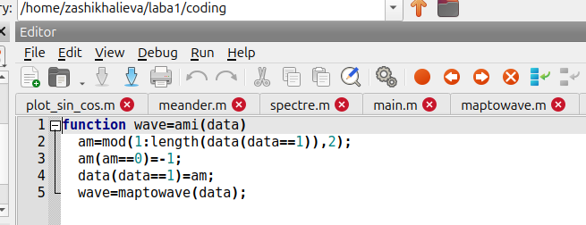{#fig:008 width=70%}

На рис. 9 показаны графики меандра, реализованные с различным количеством гармоник (от 1 до 8).

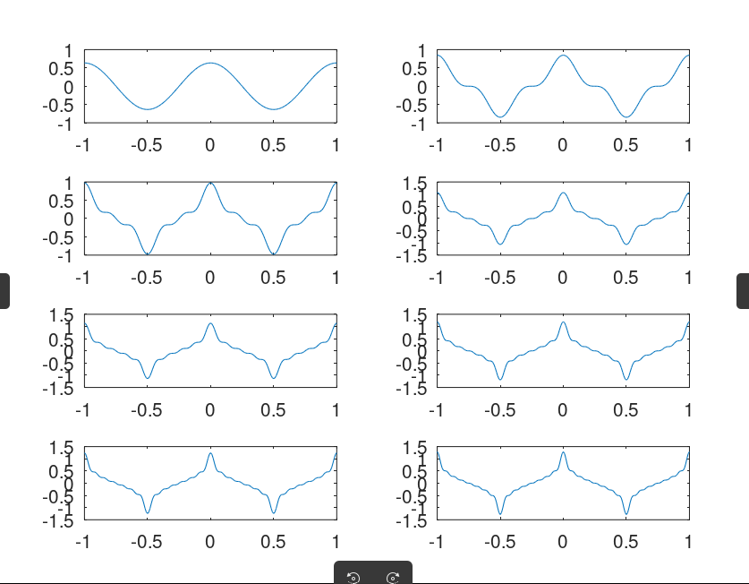{#fig:009 width=70%}

На рис. 10 представлены параметры пиков сигнала.

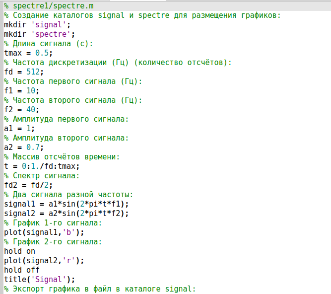{#fig:010 width=70%}

## 4. Определение спектра сигналов

Для анализа спектра сигналов был создан файл `spectre.m` (рис. 11). Были сгенерированы два синусоидальных сигнала с частотами 10 Гц и 40 Гц и амплитудами 1 и 0.7 соответственно.

{#fig:011 width=70%}

Листинг кода для построения сигналов:
```octave
% Длина сигнала (с)
tmax = 0.5;
% Частота дискретизации (Гц)
fd = 512;
% Частоты сигналов
f1 = 10;
f2 = 40;
% Амплитуды
a1 = 1;
a2 = 0.7;
% Массив отсчётов времени
t = 0:1./fd:tmax;
% Сигналы
signal1 = a1*sin(2*pi*t*f1);
signal2 = a2*sin(2*pi*t*f2);

На рис. 12 представлен график двух синусоидальных сигналов разной частоты.

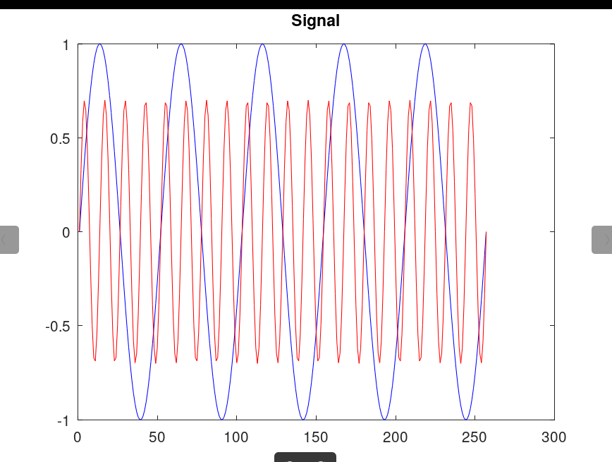{#fig:012 width=70%}

С помощью быстрого преобразования Фурье (БПФ) были найдены спектры сигналов. На рис. 13 показан некорректированный график спектров.

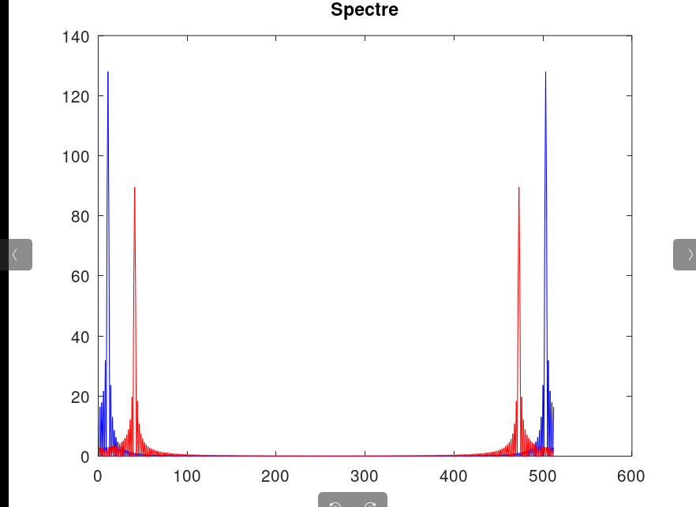{#fig:013 width=70%}

После корректировки (отбрасывание отрицательных частот и нормировка по амплитуде) был получен исправленный график спектров (рис. 14).

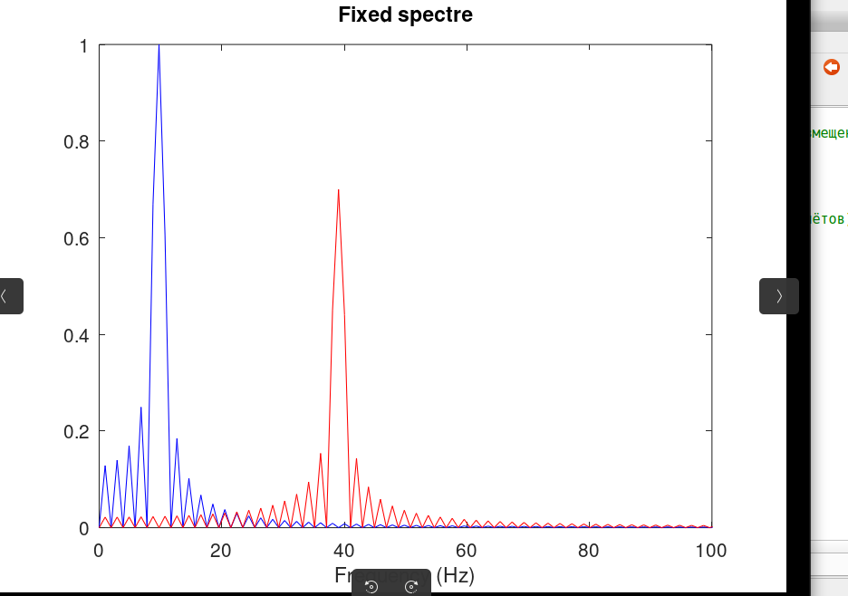{#fig:014 width=70%}

На рис. 16 и 18 представлены спектры суммы рассмотренных сигналов.

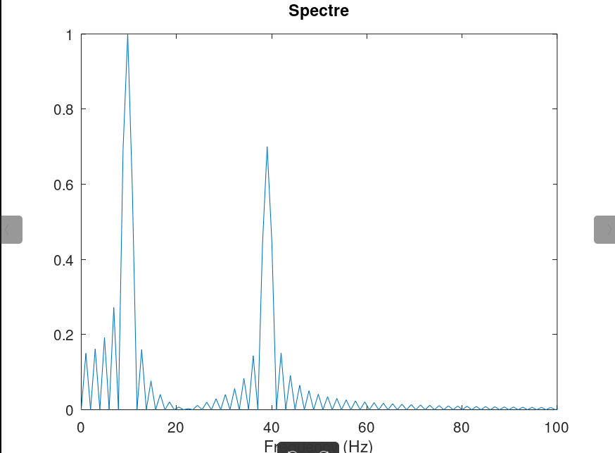{#fig:015 width=70%}

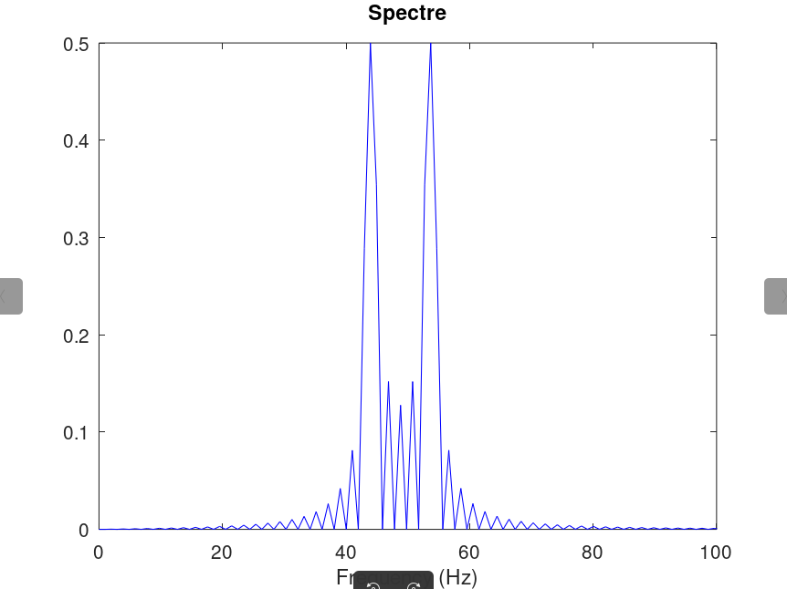{#fig:016 width=70%}

## 5. Амплитудная модуляция

Для демонстрации принципов амплитудной модуляции был создан файл `am.m`. Модуляция выполнялась путём перемножения низкочастотного сигнала (5 Гц) и высокочастотной несущей (50 Гц).

На рис. 15 представлен результат модуляции: синим цветом показан модулированный сигнал, красным — огибающая.

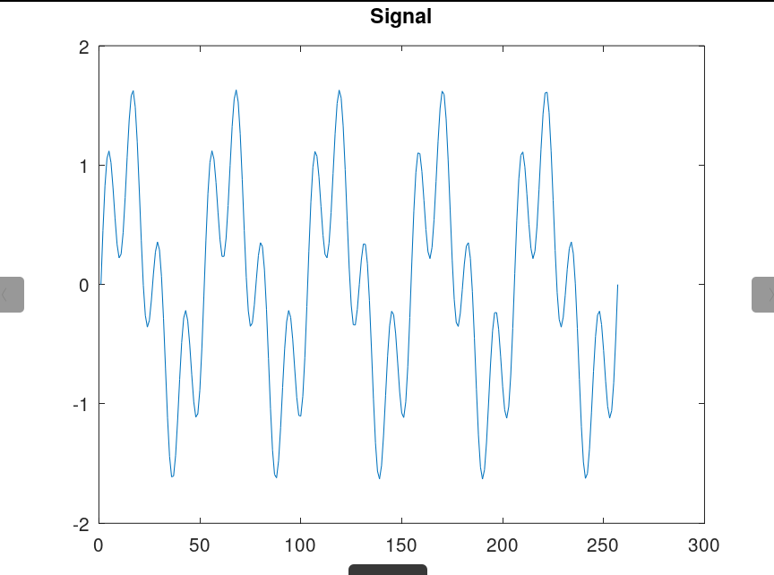{#fig:017 width=70%}

## 6. Кодирование сигнала

### 6.1. Реализация функций кодирования

Для кодирования сигнала были созданы следующие файлы-функции (рис. 20, 22-23, 26-30):

- `unipolar.m` — униполярное кодирование
- `ami.m` — AMI-кодирование
- `bipolarnrz.m` — NRZ-кодирование
- `bipolarrz.m` — RZ-кодирование
- `manchester.m` — манчестерское кодирование
- `diffmanc.m` — дифференциальное манчестерское кодирование

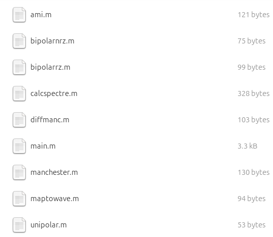{#fig:018 width=70%}

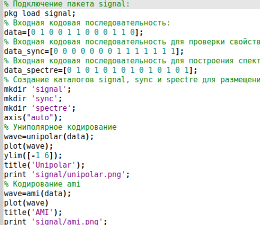{#fig:019 width=70%}

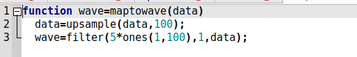{#fig:020 width=70%}

{#fig:021 width=70%}

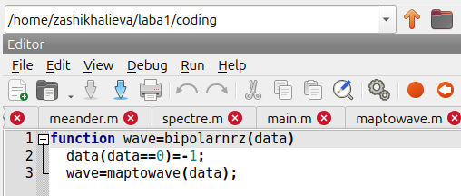{#fig:022 width=70%}

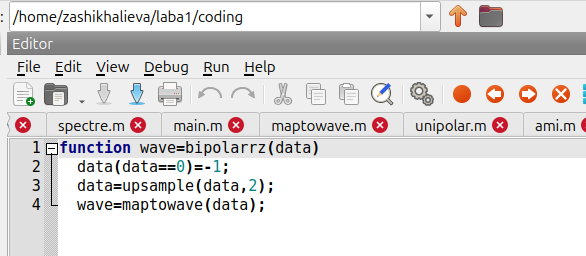{#fig:023 width=70%}

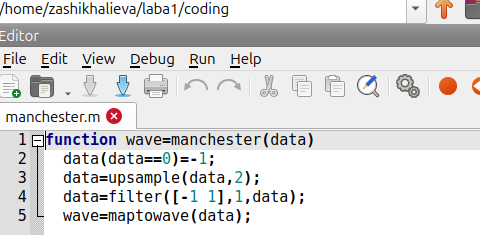{#fig:024 width=70%}

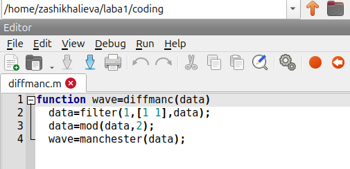{#fig:025 width=70%}

Функция `maptowave.m` выполняет преобразование дискретной последовательности в непрерывный сигнал с помощью повышающей дискретизации (upsample) и фильтрации.

### 6.2. Результаты кодирования

В основном файле `main.m` были заданы три входные последовательности:
- `data = [0 1 0 0 1 1 0 0 0 1 1 0]` — для построения основных графиков;
- `data_sync` — для проверки свойства самосинхронизации;
- `data_spectre` — для построения спектров.

На рис. 32 представлены результаты кодирования для последовательности `data`:

- **AMI**: сигнал с чередованием полярности для единиц
- **Bipolar NRZ**: биполярный сигнал без возврата к нулю
- **Bipolar RZ**: биполярный сигнал с возвратом к нулю
- **Manchester**: переход в центре каждого бита
- **Differential Manchester**: переход в начале бита для нуля

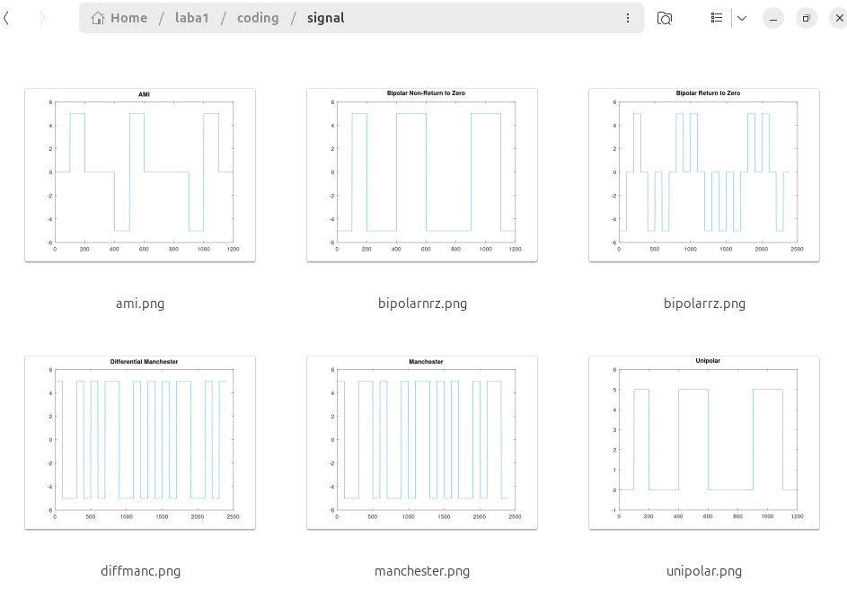{#fig:026 width=70%}

### 6.3. Исследование свойства самосинхронизации

Для проверки самосинхронизации использовалась последовательность с длинной серией одинаковых битов. На рис. 33 представлены результаты:

- **Униполярное кодирование** — нет самосинхронизации (при длинной серии нулей сигнал не изменяется)
- **AMI** — есть самосинхронизация (обеспечивается чередованием полярности единиц)
- **NRZ** — нет самосинхронизации
- **RZ** — есть самосинхронизация (за счёт возврата к нулю)
- **Manchester** — есть самосинхронизация (благодаря переходу в центре каждого бита)
- **Differential Manchester** — есть самосинхронизация

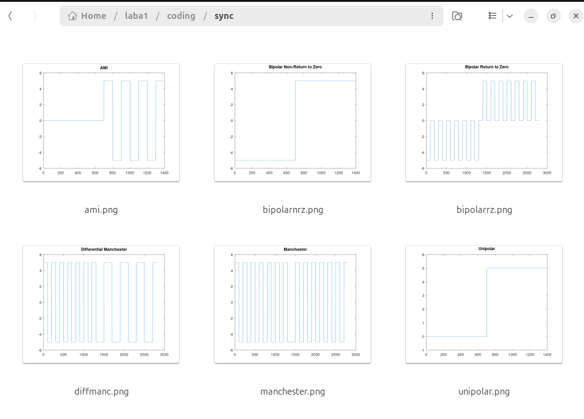{#fig:027 width=70%}

### 6.4. Спектры кодированных сигналов

На рис. 34 представлены спектры всех реализованных кодов:

- **Униполярный код** имеет ярко выраженную постоянную составляющую
- **AMI и NRZ** имеют схожий спектр с меньшей постоянной составляющей
- **RZ** имеет более широкий спектр из-за возврата к нулю
- **Манчестерский код** смещает энергию в область высоких частот, что упрощает выделение тактовой частоты

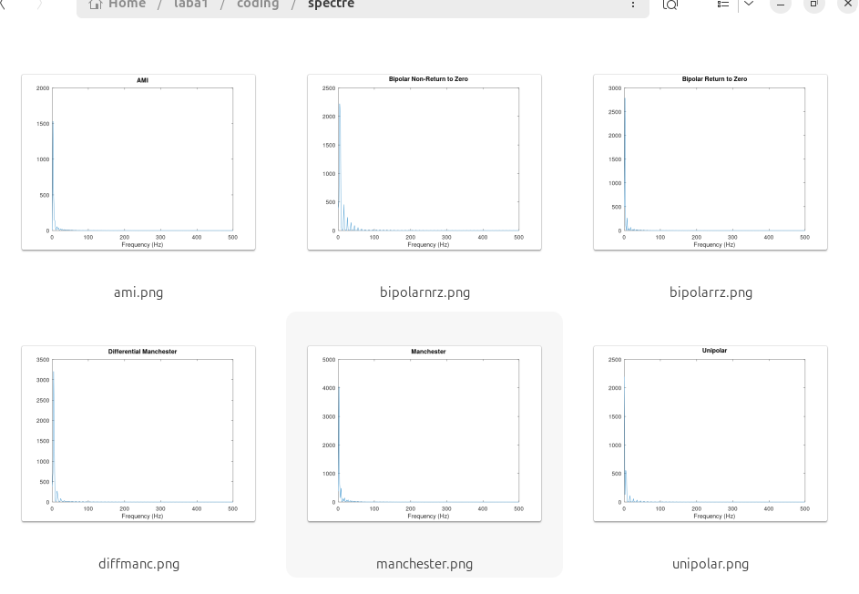{#fig:028 width=70%}

# Результаты

В таблице 1 представлены результаты проверки свойства самосинхронизации для каждого метода кодирования.

| Метод кодирования | Самосинхронизация |
|-------------------|-------------------|
| Униполярный | Нет |
| AMI | Да (при наличии сигнала) |
| NRZ | Нет |
| RZ | Да |
| Манчестерский | Да |
| Дифференциальный манчестерский | Да |

# Выводы

В ходе выполнения лабораторной работы были достигнуты следующие результаты:

1. **Установлен и настроен Octave** с пакетом signal для обработки сигналов.

2. **Построены графики функций** y1 = sin x + (1/3) sin 3x + (1/5) sin 5x и y2 = cos x + (1/3) cos 3x + (1/5) cos 5x.

3. **Выполнено разложение меандра в ряд Фурье**. Установлено, что увеличение количества гармоник приводит к более точному приближению к идеальной форме сигнала.

4. **Проведён спектральный анализ сигналов** с помощью быстрого преобразования Фурье. Показано, что частота дискретизации должна быть не менее удвоенной максимальной частоты сигнала (теорема Котельникова).

5. **Продемонстрирован принцип амплитудной модуляции**, при котором низкочастотный информационный сигнал переносится на высокочастотную несущую.

6. **Реализованы шесть методов линейного кодирования**:
   - Униполярный код — не обладает самосинхронизацией
   - AMI-код — обеспечивает самосинхронизацию при наличии единиц
   - NRZ — не имеет самосинхронизации
   - RZ, манчестерский и дифференциальный манчестерский коды — обладают свойством самосинхронизации

7. **Построены спектры** всех реализованных кодов, что позволило оценить их частотные характеристики.

Таким образом, все поставленные задачи выполнены в полном объёме.

# Список литературы

1. GNU Octave Documentation. — URL: https://octave.org/doc/
2. Котельников В. А. О пропускной способности эфира и проволоки в электросвязи. — М.: Изд-во АН СССР, 1947.
3. Шеннон К. Работы по теории информации и кибернетике. — М.: Изд-во иностр. лит., 1963.
4. Методические указания к лабораторной работе №1 "Методы кодирования и модуляция сигналов".
